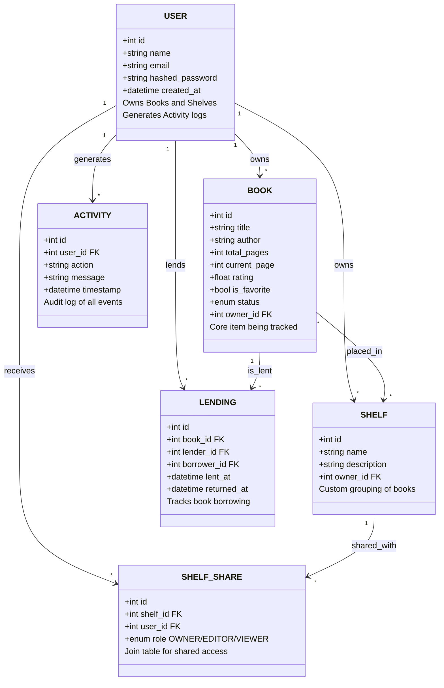

# BookNest

BookNest is a real-time, full-stack web application designed for avid readers to manage their personal libraries, track their reading progress, organize books into custom shelves, and share their collection with friends. The platform includes a seamless lending system allowing users to borrow and lend physical books within their network.

## Getting Started

Follow these instructions to get a copy of the project up and running on your local machine for development and testing purposes.

### Prerequisites

Ensure you have the following installed on your local machine:
- [Node.js](https://nodejs.org/en/) (v18+)
- [Python 3.11+](https://www.python.org/)
- [PostgreSQL](https://www.postgresql.org/)
- [`uv`](https://github.com/astral-sh/uv) (for ultra-fast Python package management)

### Clean Clone Installation

1. **Clone the repository:**
   ```bash
   git clone https://github.com/Ayush-parija/book-nest.git
   cd book-nest
   ```

2. **Database Setup:**
   Ensure PostgreSQL is running and create a new database named `booknest`.

3. **Backend Setup:**
   Navigate into the backend folder, install dependencies, configure environment variables, and run migrations.
   ```bash
   cd backend
   
   # Copy the example environment variables file and update your DATABASE_URL if needed
   cp .env.example .env
   
   # Sync Python dependencies using uv
   uv sync
   
   # Run Alembic migrations to create tables
   uv run alembic upgrade head
   
   # Run the seed script to populate test data (creates test users Alice & Bob, shelves, and lending records)
   # Note: For Windows cmd, you may need to set PYTHONIOENCODING=utf-8 before running the seed script if emoji errors occur.
   uv run python seed.py
   
   # Start the FastAPI server
   uv run uvicorn app.main:app --reload
   ```

4. **Frontend Setup:**
   Open a new terminal tab, navigate into the frontend folder, install dependencies, and start the Vite dev server.
   ```bash
   cd frontend
   npm install
   npm run dev
   ```

5. **Login:**
   Access the app at `http://localhost:5174` (or whatever port Vite suggests) and login with:
   - Email: `alice@example.com` or `bob@example.com`
   - Password: `Password@123`

## Architecture & Data Model

BookNest follows a relational data model designed for scalability and real-time updates. Each entity below is shown as an individual box with its key fields and responsibilities.

> [!NOTE]
> All relationships are strictly enforced at the database level using SQLAlchemy foreign keys and cascade rules.



## Stack Choice & Rationale

- **Backend**: **FastAPI** (Python) + **SQLAlchemy** (ORM) + **Alembic** (Migrations). FastAPI was chosen for its excellent developer experience, automatic Swagger UI documentation, strict type validation via Pydantic, and native support for async tasks and WebSockets.
- **Frontend**: **React** (Vite) + **Bootstrap**. React provides a component-driven architecture for dynamic interfaces, and Vite ensures lightning-fast HMR (Hot Module Replacement) during development.
- **Database**: **PostgreSQL**. A robust, open-source relational database that perfectly models the complex relationships (shares, lending) while maintaining data integrity.

## Refresh-Token Flow

Authentication is handled securely via JWT (JSON Web Tokens).
- **Access Tokens**: Short-lived (e.g., 30 minutes). Stored in memory or short-lived state in the frontend. Attached as a Bearer token in the `Authorization` header for all protected API calls.
- **Refresh Tokens**: Long-lived (e.g., 7 days). Stored in an `HttpOnly` cookie on the client. 
- **Flow**: When the Access Token expires, the frontend detects a `401 Unauthorized` response. It automatically sends a request to the `/refresh` endpoint, which reads the `HttpOnly` cookie, validates it, and issues a new Access Token without requiring the user to log in again. If the refresh token is expired or invalid, the user is redirected to the login page.

## Role Enforcement (Owner/Editor/Viewer)

To prevent unauthorized changes, especially via direct API calls, BookNest enforces strict role-based access control (RBAC) at the middleware/dependency level:
- **Viewer**: Can read shelf data but cannot add/remove books or delete the shelf.
- **Editor**: Can add/remove books but cannot delete the shelf or manage shares.
- **Owner**: Full administrative control.

**Implementation**: The backend uses dependency injection (`PermissionService.require_editor()`, etc.). When a request hits a shelf endpoint, the service queries `ShelfShare` to resolve the user's role before proceeding with any database transaction. This ensures that even if a frontend button is bypassed, the API drops the request with a `403 Forbidden` error.

## Real-Time WebSocket Architecture

BookNest provides real-time activity feeds and instant toast notifications without page reloads.

- **Connection**: On successful login, the React frontend instantiates a global `WebSocketService` that connects to `/ws`.
- **Authentication**: (In a production setup, the WS connection validates the JWT either via a query param or an initial auth message).
- **State Management**: A unified `ConnectionManager` (in `connection_manager.py`) holds an array of all active `WebSocket` objects in the FastAPI backend.
- **Synchronous Broadcasting**: Because our database CRUD services run synchronously (for performance and simplified transaction management), the `ConnectionManager` utilizes `asyncio.run_coroutine_threadsafe` to safely dispatch asynchronous broadcast events back to the main event loop.
- **Disconnects/Reconnects**: The React client includes an automatic exponential backoff reconnection strategy. If the server drops the connection, the client will silently try to reconnect at increasing intervals.

## What was hard and how I worked through it

One of the most complex challenges I faced during the development of BookNest was bridging the gap between my synchronous database service layer and the asynchronous WebSocket connections used for real-time notifications. Initially, implementing the WebSocket broadcast function forced me to convert my entire service layer—such as my book and shelf services—into `async` functions. However, FastAPI executes standard router endpoints in a threadpool without a running event loop, which immediately caused Pydantic to throw `ResponseValidationError` exceptions when attempting to serialize unresolved coroutine objects. 

To resolve this, I decided to revert my core service and repository layers back to clean, synchronous functions, which greatly simplified database transaction management with SQLAlchemy. I worked through the WebSocket concurrency issue by redesigning my `ConnectionManager`. I tracked the main asynchronous event loop upon server startup and implemented a `send_to_user_sync` method utilizing `asyncio.run_coroutine_threadsafe`. This architectural decision allowed my threadpool-bound CRUD services to safely dispatch real-time events into the async WebSocket stream without blocking the server or triggering serialization errors. Additionally, implementing a seamless, silent JWT refresh token flow using `HttpOnly` cookies and Axios interceptors required careful debugging of race conditions to ensure users stayed authenticated without repetitive logins.

## Known issues / What is incomplete

While BookNest is fully functional, there are several areas I recognize as technical debt and opportunities for future enhancement. Currently, the real-time WebSocket architecture relies on an in-memory `ConnectionManager`. This works perfectly for a single-server deployment, but it limits scalability; if the backend were deployed across multiple instances behind a load balancer, users connected to different servers wouldn't receive each other's broadcasts. Integrating Redis Pub/Sub to sync WebSocket state across horizontally scaled nodes is a necessary future architectural improvement. 

Furthermore, while the backend enforces strict role-based access control (RBAC) at the service level for shared shelves, the WebSocket authentication handshake requires stricter validation to immediately drop unauthenticated clients upon connection, rather than relying solely on query parameter tokens. On the frontend UI, the activity feeds and book lists currently fetch data continuously. I plan to implement server-side cursor-based pagination and Redis caching to optimize performance as user libraries grow. Finally, the project currently lacks a comprehensive automated testing suite. Adding unit and integration tests using `pytest` for the FastAPI backend and React Testing Library for the frontend components is my highest priority before considering the application fully production-ready.

## AI Usage

During the development of BookNest, I used AI-powered coding assistants (such as GitHub Copilot and Gemini) as productivity tools to accelerate my development workflow. Here is a transparent breakdown of how AI was utilized:

- **Code Scaffolding**: AI was used to generate boilerplate code for repetitive patterns like Pydantic schemas, SQLAlchemy model definitions, and CRUD repository methods. Every generated snippet was reviewed, tested, and adapted to fit BookNest's architecture.
- **Documentation & Comments**: AI assisted in drafting comprehensive docstrings, file headers, and inline comments across the backend services (`book_service.py`, `activity_service.py`, `dashboard_service.py`). All documentation was reviewed for accuracy.
- **Debugging Assistance**: When encountering complex issues—such as the synchronous-to-asynchronous WebSocket bridging problem described above—AI was used to brainstorm potential solutions. The final `asyncio.run_coroutine_threadsafe` approach was validated through manual testing.
- **README Structuring**: AI helped structure and refine sections of this README, including the architecture diagrams and the "What was hard" narrative. All content reflects my genuine development experience.

> **Important**: All core architectural decisions, database schema design, RBAC logic, WebSocket event scoping, and business validation rules were designed and implemented by me. AI served as a coding accelerator, not a replacement for engineering judgment.
