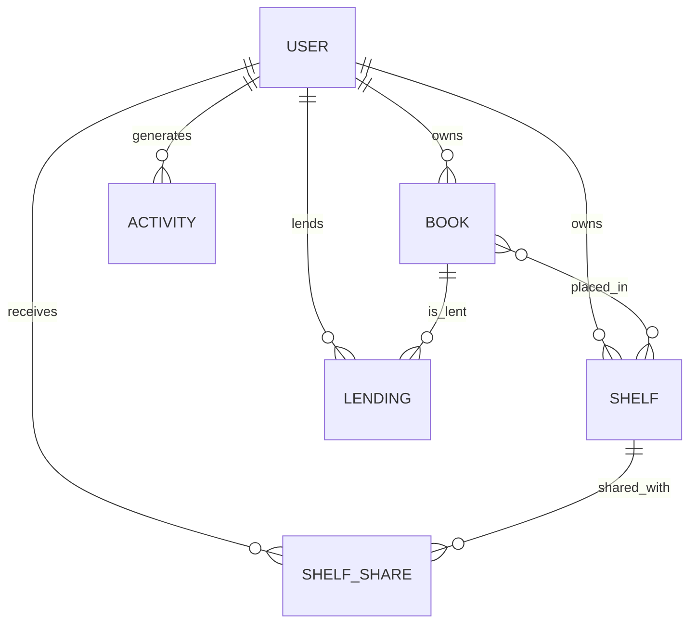

# BookNest

BookNest is a real-time, full-stack web application designed for avid readers to manage their personal libraries, track their reading progress, organize books into custom shelves, and share their collection with friends. The platform includes a seamless lending system allowing users to borrow and lend physical books within their network.

## Getting Started

Follow these instructions to get a copy of the project up and running on your local machine for development and testing purposes.

### Prerequisites

Ensure you have the following installed on your local machine:
- [Node.js](https://nodejs.org/en/) (v18+)
- [Python 3.11+](https://www.python.org/)
- [PostgreSQL](https://www.postgresql.org/)
- [`uv`](https://github.com/astral-sh/uv) (for ultra-fast Python package management)

### Clean Clone Installation

1. **Clone the repository:**
   ```bash
   git clone https://github.com/yourusername/book-nest.git
   cd book-nest
   ```

2. **Database Setup:**
   Ensure PostgreSQL is running and create a new database named `booknest`.

3. **Backend Setup:**
   Navigate into the backend folder, install dependencies, configure environment variables, and run migrations.
   ```bash
   cd backend
   
   # Copy the example environment variables file and update your DATABASE_URL if needed
   cp .env.example .env
   
   # Sync Python dependencies using uv
   uv sync
   
   # Run Alembic migrations to create tables
   uv run alembic upgrade head
   
   # Run the seed script to populate test data (creates test users Alice & Bob, shelves, and lending records)
   # Note: For Windows cmd, you may need to set PYTHONIOENCODING=utf-8 before running the seed script if emoji errors occur.
   uv run python seed.py
   
   # Start the FastAPI server
   uv run uvicorn app.main:app --reload
   ```

4. **Frontend Setup:**
   Open a new terminal tab, navigate into the frontend folder, install dependencies, and start the Vite dev server.
   ```bash
   cd frontend
   npm install
   npm run dev
   ```

5. **Login:**
   Access the app at `http://localhost:5174` (or whatever port Vite suggests) and login with:
   - Email: `alice@example.com` or `bob@example.com`
   - Password: `Password@123`

## Architecture & Data Model

BookNest follows a relational data model designed for scalability and real-time updates. Below is the core architecture:

| 🏗️ Entity | 📖 Description | 🔑 Key Relationships |
|:---|:---|:---|
| **Users** | Authentication (hashed passwords) and profiles. | Owns `Books`, `Shelves`. Generates `Activities`. |
| **Books** | The core item being tracked (title, author, progress, rating). | Placed in `Shelves`. Can be `Lent`. |
| **Shelves** | Custom groupings of books created by a user. | Shared via `ShelfShares`. |
| **ShelfShares** | Join table linking Users to Shelves they don't own. | Tracks `ShelfRole` (OWNER, EDITOR, VIEWER). |
| **Lendings** | Record indicating a Book is temporarily with another User. | Tracks `lent_at` and `returned_at`. |
| **Activity** | Audit log of all significant events. | Used for WebSocket notifications. |

> [!NOTE]
> All relationships are strictly enforced at the database level using SQLAlchemy foreign keys and cascade rules.



## Stack Choice & Rationale

- **Backend**: **FastAPI** (Python) + **SQLAlchemy** (ORM) + **Alembic** (Migrations). FastAPI was chosen for its excellent developer experience, automatic Swagger UI documentation, strict type validation via Pydantic, and native support for async tasks and WebSockets.
- **Frontend**: **React** (Vite) + **Bootstrap**. React provides a component-driven architecture for dynamic interfaces, and Vite ensures lightning-fast HMR (Hot Module Replacement) during development.
- **Database**: **PostgreSQL**. A robust, open-source relational database that perfectly models the complex relationships (shares, lending) while maintaining data integrity.

## Refresh-Token Flow

Authentication is handled securely via JWT (JSON Web Tokens).
- **Access Tokens**: Short-lived (e.g., 30 minutes). Stored in memory or short-lived state in the frontend. Attached as a Bearer token in the `Authorization` header for all protected API calls.
- **Refresh Tokens**: Long-lived (e.g., 7 days). Stored in an `HttpOnly` cookie on the client. 
- **Flow**: When the Access Token expires, the frontend detects a `401 Unauthorized` response. It automatically sends a request to the `/refresh` endpoint, which reads the `HttpOnly` cookie, validates it, and issues a new Access Token without requiring the user to log in again. If the refresh token is expired or invalid, the user is redirected to the login page.

## Role Enforcement (Owner/Editor/Viewer)

To prevent unauthorized changes, especially via direct API calls, BookNest enforces strict role-based access control (RBAC) at the middleware/dependency level:
- **Viewer**: Can read shelf data but cannot add/remove books or delete the shelf.
- **Editor**: Can add/remove books but cannot delete the shelf or manage shares.
- **Owner**: Full administrative control.

**Implementation**: The backend uses dependency injection (`PermissionService.require_editor()`, etc.). When a request hits a shelf endpoint, the service queries `ShelfShare` to resolve the user's role before proceeding with any database transaction. This ensures that even if a frontend button is bypassed, the API drops the request with a `403 Forbidden` error.

## Real-Time WebSocket Architecture

BookNest provides real-time activity feeds and instant toast notifications without page reloads.

- **Connection**: On successful login, the React frontend instantiates a global `WebSocketService` that connects to `/ws`.
- **Authentication**: (In a production setup, the WS connection validates the JWT either via a query param or an initial auth message).
- **State Management**: A unified `ConnectionManager` (in `connection_manager.py`) holds an array of all active `WebSocket` objects in the FastAPI backend.
- **Synchronous Broadcasting**: Because our database CRUD services run synchronously (for performance and simplified transaction management), the `ConnectionManager` utilizes `asyncio.run_coroutine_threadsafe` to safely dispatch asynchronous broadcast events back to the main event loop.
- **Disconnects/Reconnects**: The React client includes an automatic exponential backoff reconnection strategy. If the server drops the connection, the client will silently try to reconnect at increasing intervals.

## Challenges & Solutions

### The Async/Sync WebSocket Trap
**Challenge**: When WebSockets were first introduced, the `await manager.broadcast()` call forced us to convert our entire service layer (`book_service`, `shelf_service`) to `async def`. However, FastAPI runs normal `def` router endpoints in a threadpool where there is no running event loop. This caused Pydantic to throw `ResponseValidationError` when it attempted to serialize unresolved coroutine objects.
**Solution**: We successfully reverted the entire service layer back to standard, clean synchronous functions. We achieved real-time broadcasting by tracking the main event loop inside the `ConnectionManager` and exposing a `broadcast_sync` method. This allowed our threadpool-bound CRUD services to safely push messages into the async WebSocket stream without blocking or throwing errors.

## Known Issues & What's Incomplete
- **Targeted WebSocket Events**: Currently, activity is broadcast globally. We need to implement room-based or user-specific broadcasting so users only receive notifications relevant to their own actions or shelves shared with them.
- **WebSocket Auth Verification**: The WebSocket connection needs stricter handshake validation to ensure unauthenticated clients are dropped immediately upon connection.

## Future Improvements
- **Pagination & Caching**: Implement cursor-based pagination for the Activity feed and Redis caching for frequently accessed shelves.
- **Testing**: Add a comprehensive suite of unit and integration tests using `pytest` and `React Testing Library`.
- **Dockerization**: Containerize the database, backend, and frontend via `docker-compose` for a true one-click setup.


